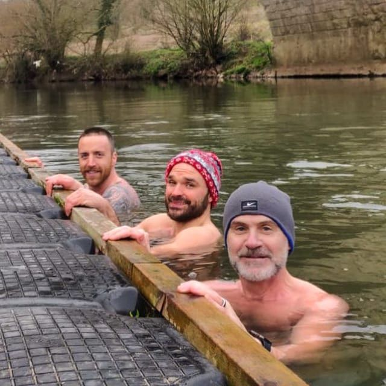

The first time I got into proper cold water it was a UK river in February, in a wetsuit only on my feet, with two friends who had been doing it longer than I had. I lasted maybe ninety seconds, came out swearing, and felt better that afternoon than I had in months. That session is the reason I bought a tub.

For the next three winters I had a wooden barrel-style cold tub in the garden and I got into it three or four mornings a week, first thing, before coffee, before the day had a chance to get going. My rule was minutes per degree centigrade. If the water was 5°C I stayed in for five minutes. If it was 8°C I stayed for eight. Cheap protocol, dose scales with the stimulus, no thinking required at six in the morning.

It changed me. Not in the influencer sense. In the boring, quiet sense: better mood through the winter, better sleep, a more consistent training response, and a kind of baseline composure that I had not had in my mid-thirties. I have since moved abroad, the tub is gone, and I now get cold the way most people do, which is at spas with a cold plunge, two or three times a month. A new tub is on the shopping list.

This is the practitioner's read on what cold water actually does, what the human evidence supports, and the protocol I will be picking back up the day my new tub arrives.

## What the human data actually says

The cold-water-immersion-and-autophagy literature was thin until recently. It is no longer thin. Two recent human studies out of the University of Ottawa, led by Kelli King and Glen Kenny and published in Advanced Biology in 2024 and 2025, did proper skeletal muscle work in healthy young males before and after cold-water immersion at 14°C.

What that work supports, with reasonable confidence:

- A single one-hour cold immersion produces what the authors call "autophagic dysfunction": the protein p62 accumulates, which means the autophagy machinery has been triggered but cannot yet keep up with the load. Caspase-3, which signals programmed cell death, also rises. This is the classic acute stress signature.
- Within seven days of daily cold-water immersion, the picture flips. By day three the system reorganises. By day seven, autophagic flux is measurably higher, p62 accumulation has resolved, and the cell-death signals have dropped. The body has shifted from "stressed" to "adapted".
- The adapted state is the one we care about. It is also the one you cannot get to without doing the work first.

That is the autophagy story. The other major lines of human evidence are well-supported but somewhat older.

- Cold-induced thermogenesis, mediated by brown adipose tissue, rises substantially with habitual cold exposure. Søberg and colleagues (Cell Reports Medicine, 2021) showed experienced winter swimmers had markedly elevated cold-induced energy expenditure compared to matched controls, with brown-fat activation patterns that were genuinely different from non-swimmers.
- Catecholamine response to cold is large and reliable. The Šrámek group in 2000 showed plasma noradrenaline rising by around 530% and dopamine by around 250% after immersion in water at 14°C. The dopamine elevation persists for hours, which is the most likely explanation for the post-cold mood lift that almost everyone who does this regularly reports.
- Adapted cold-water swimmers show a reduced inflammatory response and improved insulin sensitivity, though most of this evidence comes from cohort and observational work, not randomised trials.

What the human evidence does **not** yet support, despite frequent claims:

- That cold plunging cures depression, prevents Alzheimer's, "boosts immunity" by a measurable amount, or burns fat fast enough to matter for body composition. The catecholamine and mood effects are real. The metabolic effects are real but small. The "ice bath as fat-loss tool" framing is wishful.
- That you need a specific water temperature like 11°C or 3°C. The dose is a combination of temperature and time. Get cold enough that staying in is uncomfortable; stay long enough that it adapts you; do not stay so long that you become hypothermic. The minutes-per-degree rule is one workable heuristic among several.
- That cold showers replicate cold plunges. They do not, for the autophagy or brown-fat outcomes. The skin-surface cooling from a shower is real but the core-temperature drop and the duration of stimulus are much smaller. Cold showers are better than nothing. They are not the same intervention.

Confidence in the above: **high** for the basic biology, **high** for the acute stress and adaptation pattern, **moderate** for the long-term autophagic upregulation in habitual cold-exposed adults, **low** for any claim about specific disease prevention from cold exposure alone.

## The cellular mechanism in one paragraph

Cold immersion triggers a sympathetic nervous system surge, vasoconstriction, and a sharp rise in noradrenaline. Brown adipose tissue, which is metabolically active mitochondria-rich fat sitting around the neck, collarbones and along the spine, is activated to generate heat through uncoupled respiration. Skeletal muscle and the wider thermogenic machinery are recruited in support. At the cellular level, the stress activates AMPK and suppresses mTOR, which is the same hand-off that drives autophagy in fasting and in hard exercise. Repeated cold exposure adapts the autophagy machinery itself, so the cleanup happens faster and more cleanly. The signal converges on the same pathway as the other four autophagy practices. That is why stacking them works.

## The practitioner's protocols

Four patterns hold up across the literature and across the actual cold-water community I have trained alongside.

### Minutes per degree centigrade

The protocol I used at home. Water temperature in Celsius equals minutes in the tub, give or take. 4°C means four minutes. 10°C means ten. It scales the dose to the stimulus, which is the right thing to do, and it stops you doing 30-minute sessions in 12°C water trying to chase the same kick you got at 4°C, which is how people get themselves into trouble.

Three or four mornings a week is enough. More than that and you blunt the response.

### The Søberg 11-minutes-a-week rule

Susanna Søberg, of the brown-fat paper, popularised the rule that around 11 minutes a week of total cold immersion is the threshold for measurable metabolic adaptation. Spread across three or four sessions. Water cold enough to be uncomfortable from the moment you get in.

This is the one I would give to someone starting out who wants the metabolic effect without overcomplicating it.

### Cold then hot, never the other way

If you have access to both, cold first, sauna after. Cold then hot drives the contrast response, leaves you alert, and seems to preserve the autophagy signal. Hot then cold, popular in spa culture, blunts the cold stimulus because you are warm going in and you do not get the same adaptive shock.

The exception is the traditional Finnish sequence of sauna then ice plunge then sauna again, which is its own thing and which I am not going to argue with.

### Build up. Do not jump in at the deep end

The river session I started with was at the top end of what an unadapted person should attempt. I got away with it because I was already very fit and the immersion was short. If you are new, start with cold showers for two weeks, then short cold-bath sessions at home, then work up to outdoor cold or a proper plunge tub. The risk on day one is not the cold; it is the cold-shock response, which can produce involuntary gasps and a vagal cardiac response in people who are not used to it. That is the mechanism behind most open-water cold-water fatalities.

## The athlete-specific concerns

Three real ones, in order of importance.

**Do not cold plunge immediately after strength training.** This is the cleanest finding in the post-exercise cold literature. Multiple studies, including the Roberts work and the 2024 Piñero meta-analysis in the European Journal of Sport Science, show that cold-water immersion within an hour or two of resistance training measurably attenuates the muscle hypertrophy response. Strength gains are mostly preserved. Lean mass growth is not. For an over-40 athlete trying to defend muscle, this is a real cost. If you train hard in the morning and want to cold plunge, do the plunge first, train second. Or do the plunge on a non-lifting day. Or do it at least six hours after lifting.

Cold after endurance work is a different story and is fine, even useful for between-session recovery, with the caveat that you are also blunting some of the endurance adaptations you were chasing. Use it for race-week recovery, not for adaptation phases.

**The cold-shock response is a real cardiac stressor.** The catecholamine surge that is doing the favourable work is the same surge that can trigger arrhythmias in people with undiagnosed cardiovascular disease. If you are over 50, have any cardiac risk factors, or have not had a basic check-up in a while, get one before you start regular cold immersion. This is the single most underrated risk in the cold-plunge conversation.

**Adapt slowly to outdoor cold-water swimming.** Tubs and plunge pools are controlled. Rivers, lakes and the sea are not. Currents, sudden temperature gradients, distance from shore, and the after-drop effect, where your core temperature continues falling for ten to twenty minutes after you exit, all combine to make open water a different sport. The river session I described worked because we stayed by the bank, did not swim, and got out before the after-drop took us anywhere problematic. If you want to swim in cold open water, find an experienced local group. Do not freelance it.

## What I actually do now

Right now, two or three cold sessions a month at spas, usually after a swim or a workout, plus a regular sauna habit. This is below the threshold I would call effective for the autophagy and brown-fat outcomes. I am honest about that. The sauna gives me some of the heat-shock response and is sustaining me in the meantime.

When the new tub arrives, the plan is straightforward. Three to four 5-to-8 minute sessions a week at whatever ambient temperature the water settles to. Minutes per degree. Mornings, before food. Sauna afterwards when I can. Not immediately after the days I lift heavy.

What I will not do: chase ever-lower temperatures, time my sessions in seconds, post videos of the entry. The protocol is the stimulus. Showing off about the stimulus is not part of the protocol.

## The honest caveat

The acute physiology of cold-water immersion is well-evidenced. The autophagy response in humans is increasingly well-evidenced, and the seven-day adaptation pattern from the King work is one of the cleaner stories in this corner of the literature. The translation from "autophagy markers shift favourably with regular cold exposure" to "you will live longer if you do this" is several inferential steps, and we do not have the 30-year trial. The case for cold as a longevity intervention sits on cellular, mechanistic, and observational evidence rather than long-term outcome data.

For the over-40 practitioner the practical question is not whether cold water does something useful. It does. The question is whether you can build a sustainable habit that drives the adaptation without giving yourself a cardiac event or blunting the strength training you are also doing. That answer is yes, but only if you build up properly, time it sensibly, and treat the protocol as the point rather than the temperature score.

The cellular cleanup is real. The mood lift is real. The discomfort is real and is the bit you do not get to skip. The version that works long-term is the boring, repeated, well-timed one, not the one with the thermometer reading you can brag about.

## The app

An iPhone app of the same name is in development. It will track cold-water sessions alongside the other four autophagy practices, log temperature and duration, and surface your cumulative weekly cold dose against your training and recovery. Launch will be announced here.
